# QuoSwift — System Architecture & Sequence Flows

End-to-end logic flows for the production app. All diagrams are Mermaid
(renders natively on GitHub and most Markdown viewers).

---

## 1. High-level component map

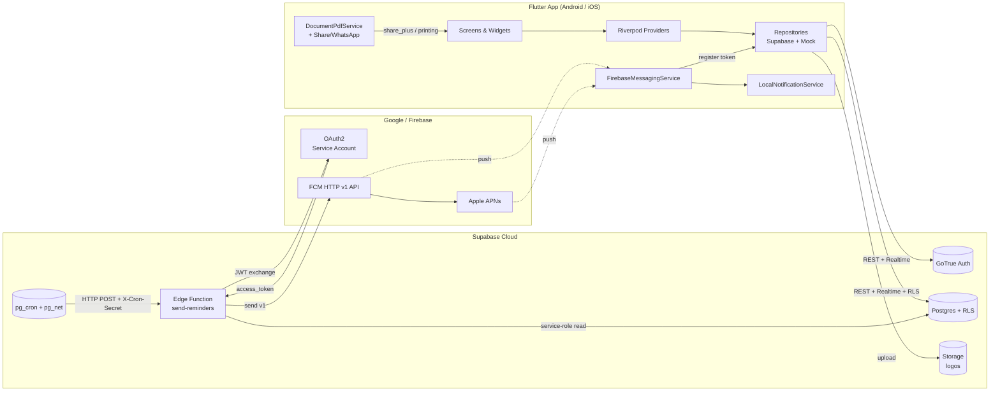

---

## 2. App startup & session resume

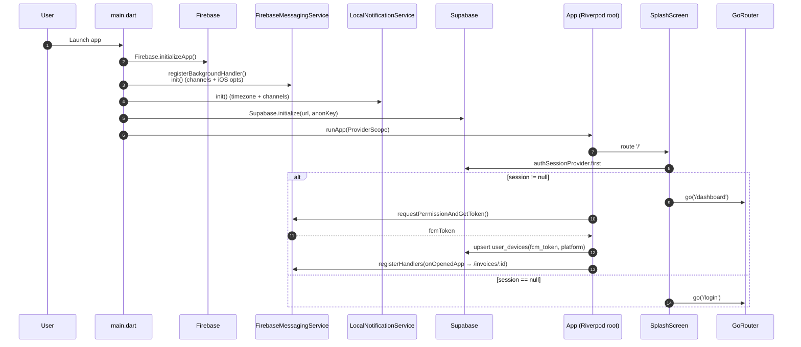

---

## 3. Authentication — sign-in / sign-up / forgot password

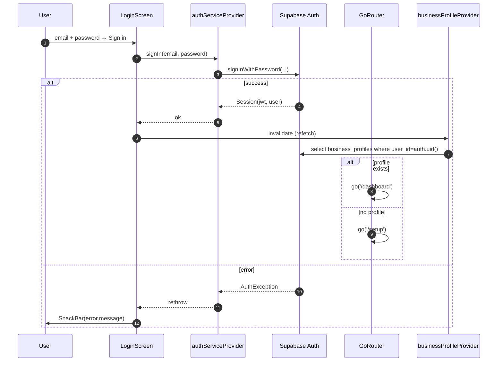

---

## 4. Customer / Quotation / Invoice CRUD (representative flow)

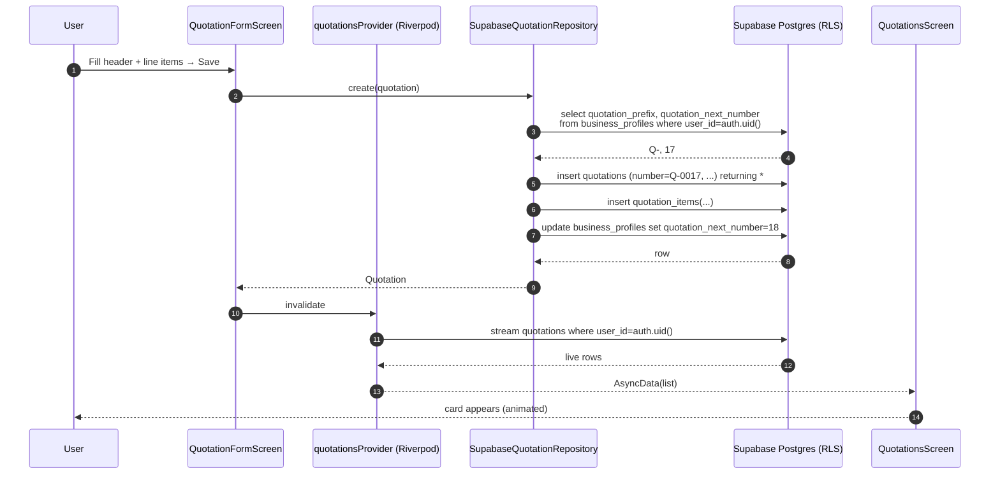

---

## 5. Quotation → Invoice conversion

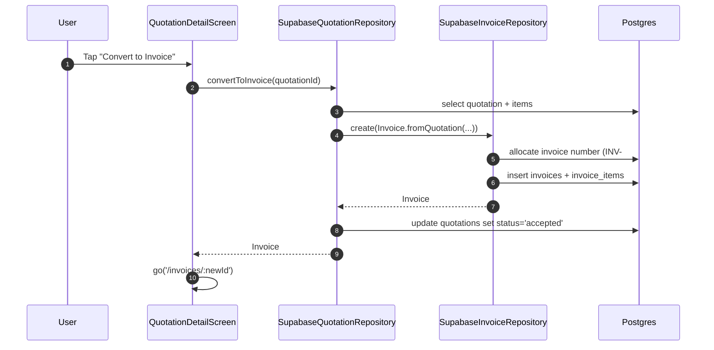

---

## 6. Record payment

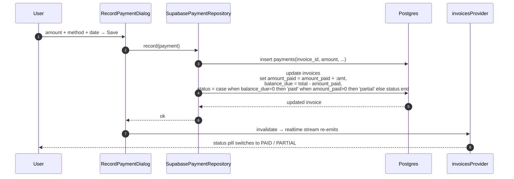

---

## 7. PDF export & share

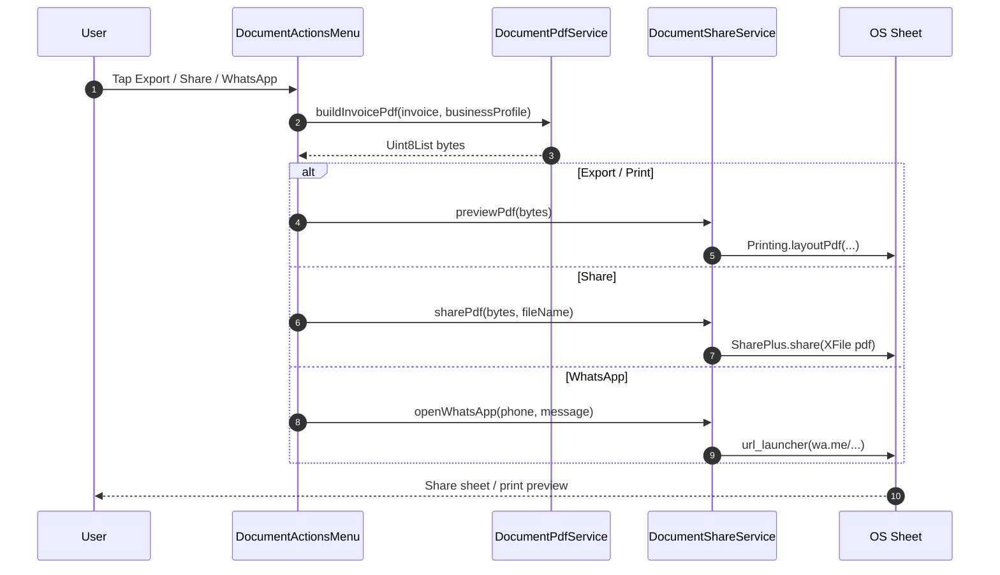

---

## 8. FCM token lifecycle (sign-in → token refresh → sign-out)

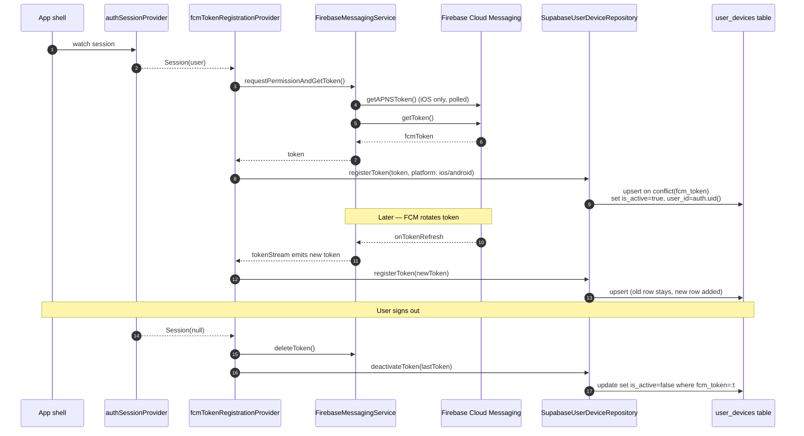

---

## 9. Daily reminder dispatch (the big one)

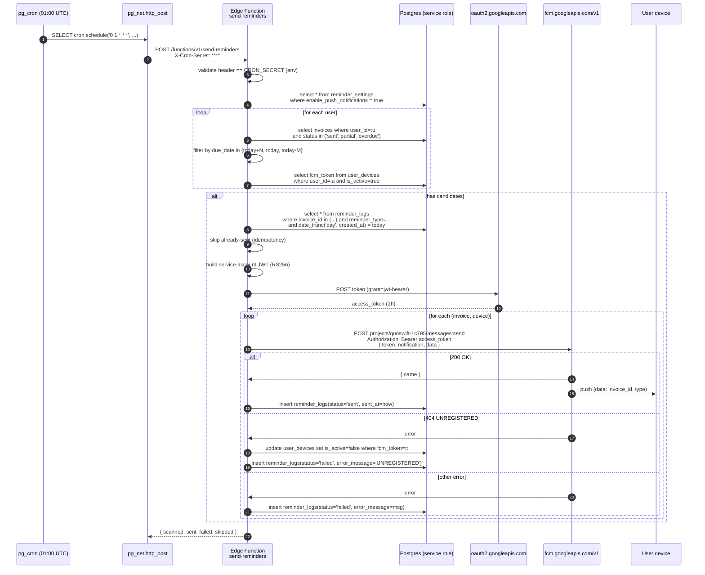

---

## 10. Push received → user taps notification

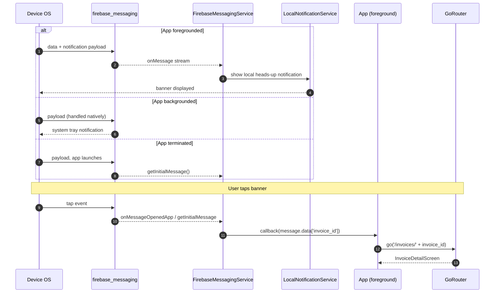

---

## 11. Realtime list updates (RLS-scoped subscription)

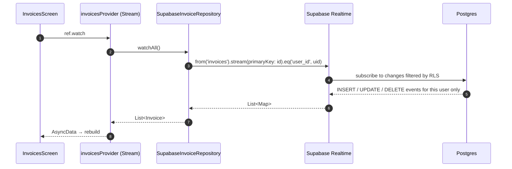

---

## 12. RLS enforcement (every read/write)

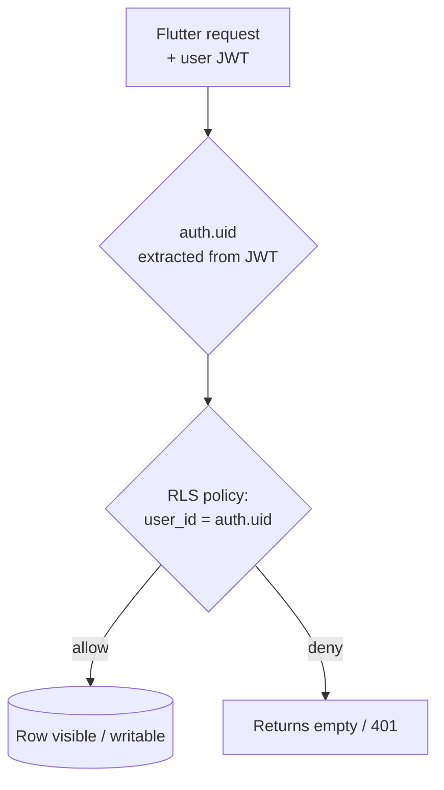

---

## Sprint completion summary (production-ready)

| Sprint | Status | Notes |
| ------ | ------ | ----- |
| 1 — Backend & Auth | ✅ | Supabase init, RLS on all tables, session-resume on splash |
| 2 — Core CRUD | ✅ | Customers, Quotations, Invoices, Payments — all Supabase-backed |
| 3 — Business Logic | ✅ | Q→I conversion, prefix numbering, reminder settings, real dashboard |
| 4 — PDF & Share | ✅ | `pdf` + `printing` + `share_plus` + WhatsApp deep-link |
| 5 — Reminders / FCM | ✅ | Native init (Android+iOS), token registration, Edge Function + pg_cron |
| 6 — Polish & QA | ✅ | All settings wired to Supabase, shimmer skeletons, empty/error states, `flutter analyze` clean |

### Outstanding **operator** actions (not code)
1. Add `GoogleService-Info.plist` to Xcode Runner target.
2. Upload APNs `.p8` key in Firebase console → Cloud Messaging.
3. Run `supabase secrets set FCM_SERVICE_ACCOUNT_JSON="$(cat ~/Downloads/...adminsdk...json)"`.
4. Run `cron.schedule('daily-reminders', '0 1 * * *', …)` SQL block (Step 6 of Edge Function README).
