# QuoSwift — System Flow Diagrams (PNG)

Pre-rendered images of every diagram in [system_flow.md](system_flow.md).
Rendered via mermaid.ink — re-render with:

```bash
python3 - <<'PY'
import re, base64, pathlib, subprocess
src = pathlib.Path("docs/system_flow.md").read_text()
for i, code in enumerate(re.findall(r"```mermaid\n(.*?)```", src, re.S), 1):
    b64 = base64.urlsafe_b64encode(code.strip().encode()).decode().rstrip("=")
    subprocess.run(["curl", "-sSL", "-o", f"docs/diagrams/{i:02d}.png",
                    f"https://mermaid.ink/img/{b64}?type=png&bgColor=white"])
PY
```

| # | Diagram | Image |
| -- | ------- | ----- |
| 1 | High-level component map | [01](diagrams/01-1-high-level-component-map.png) |
| 2 | App startup & session resume | [02](diagrams/02-2-app-startup-session-resume.png) |
| 3 | Auth (sign-in / sign-up / forgot password) | [03](diagrams/03-3-authentication-sign-in-sign-up-forgot-password.png) |
| 4 | Customer / Quotation / Invoice CRUD | [04](diagrams/04-4-customer-quotation-invoice-crud-representative-flow.png) |
| 5 | Quotation → Invoice conversion | [05](diagrams/05-5-quotation-invoice-conversion.png) |
| 6 | Record payment | [06](diagrams/06-6-record-payment.png) |
| 7 | PDF export & share | [07](diagrams/07-7-pdf-export-share.png) |
| 8 | FCM token lifecycle | [08](diagrams/08-8-fcm-token-lifecycle-sign-in-token-refresh-sign-out.png) |
| 9 | Daily reminder dispatch (cron → Edge Function → FCM) | [09](diagrams/09-9-daily-reminder-dispatch-the-big-one.png) |
| 10 | Push received → tap → deep link | [10](diagrams/10-10-push-received-user-taps-notification.png) |
| 11 | Realtime list updates (RLS) | [11](diagrams/11-11-realtime-list-updates-rls-scoped-subscription.png) |
| 12 | RLS enforcement | [12](diagrams/12-12-rls-enforcement-every-read-write.png) |

---

## Inline preview

### 1. High-level component map
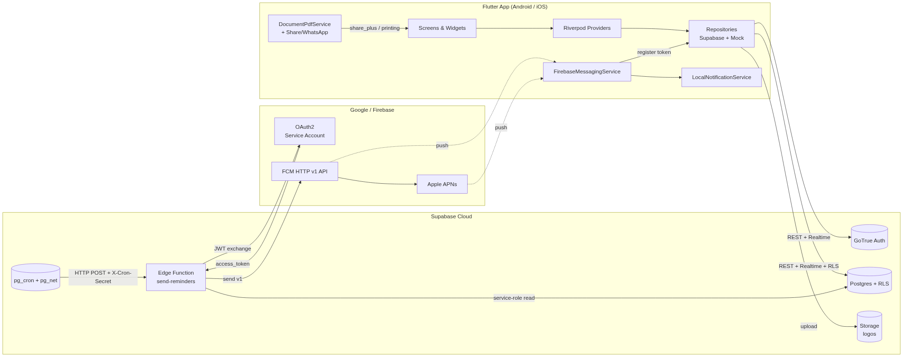

### 2. App startup & session resume
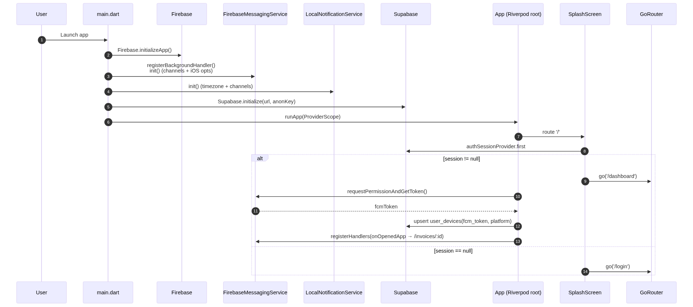

### 3. Auth — sign-in / sign-up / forgot password
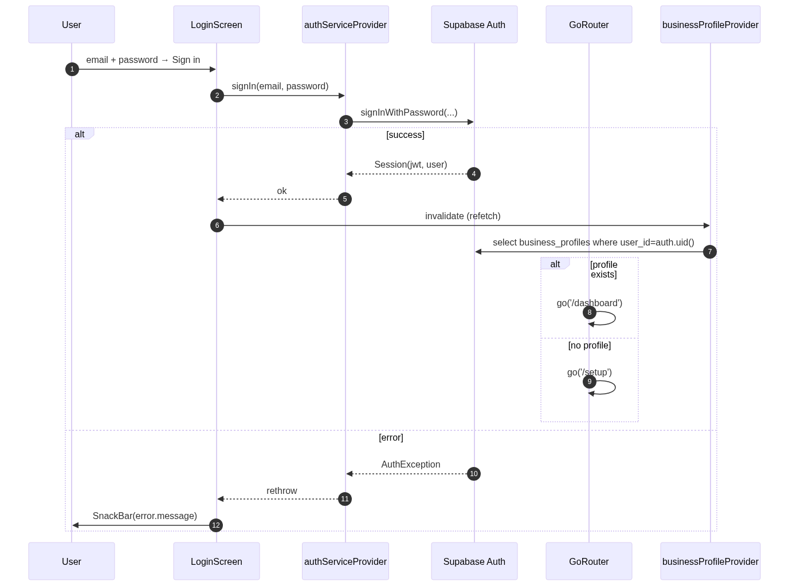

### 4. Customer / Quotation / Invoice CRUD
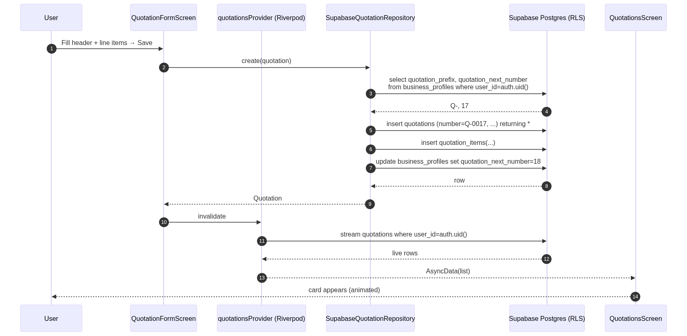

### 5. Quotation → Invoice conversion
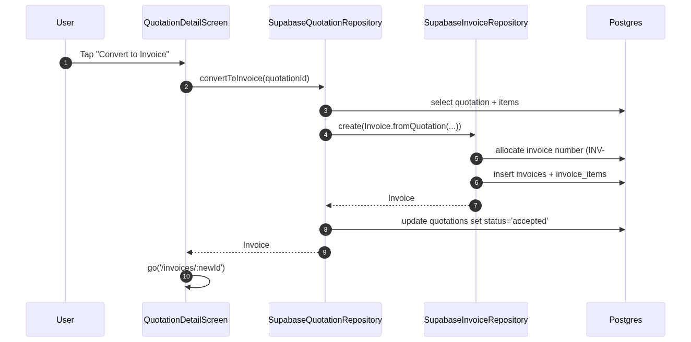

### 6. Record payment
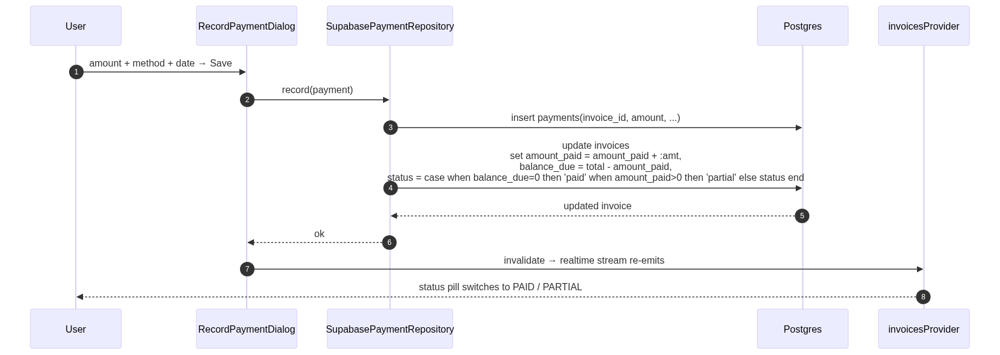

### 7. PDF export & share
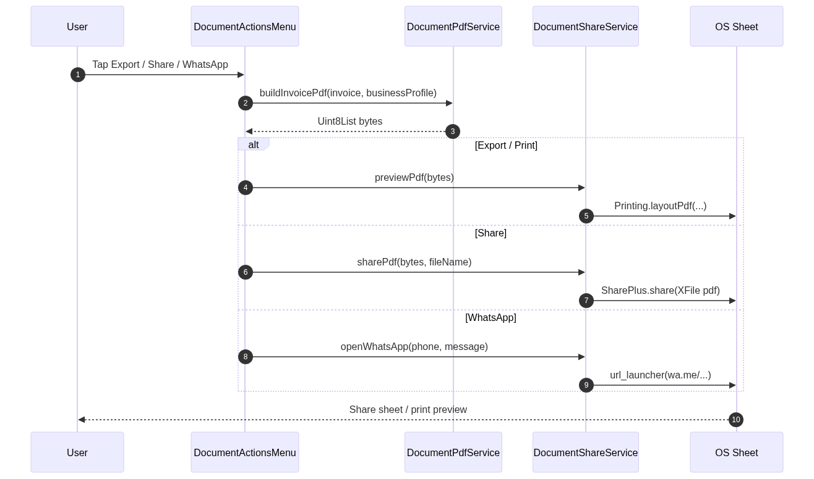

### 8. FCM token lifecycle
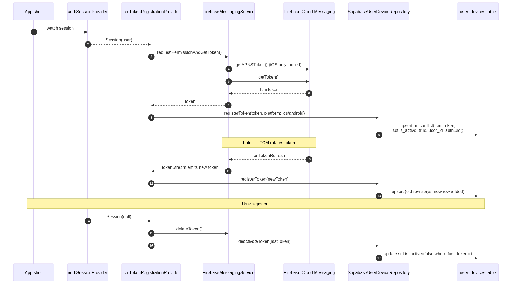

### 9. Daily reminder dispatch
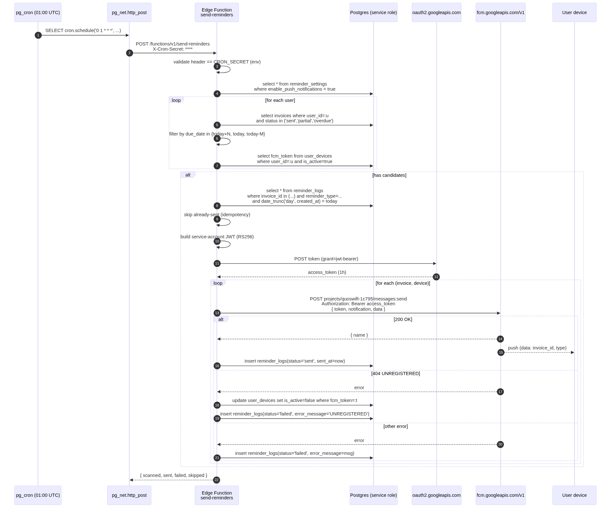

### 10. Push received → user taps notification
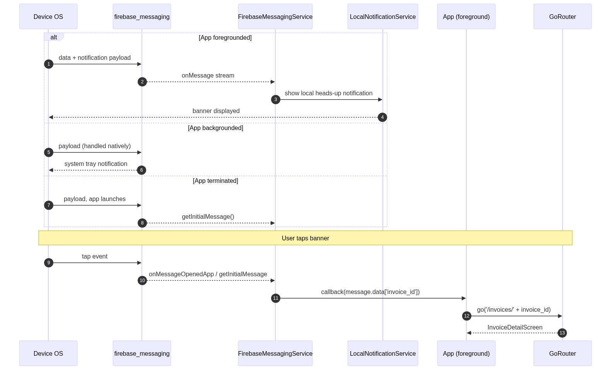

### 11. Realtime list updates (RLS)
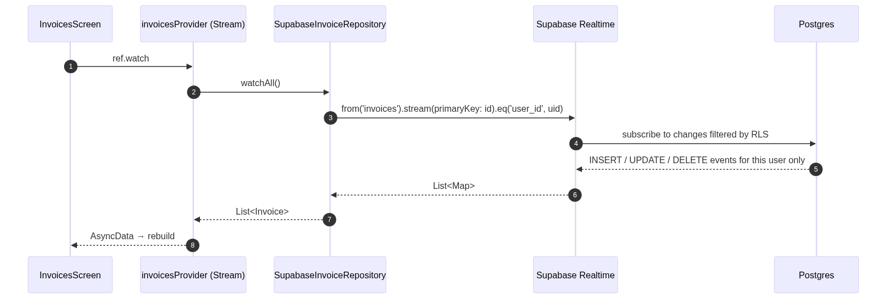

### 12. RLS enforcement
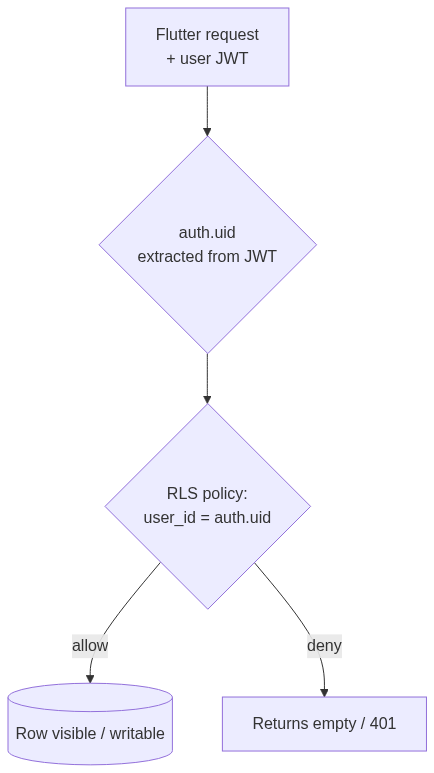
